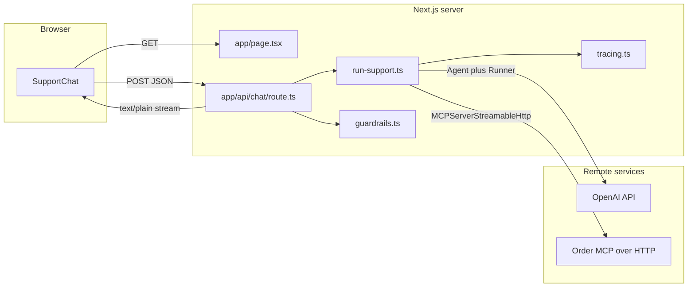
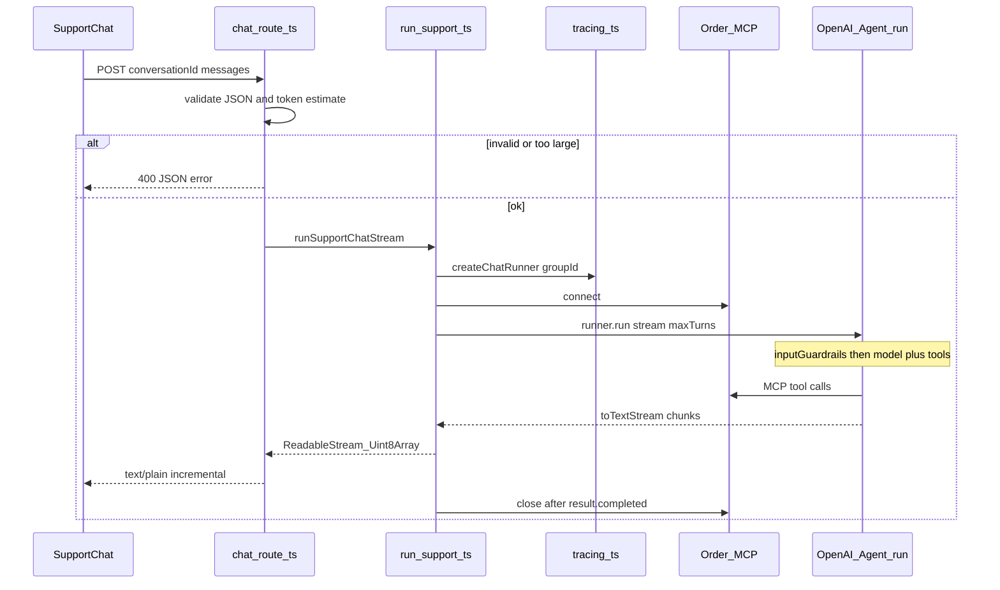

# Meridiane

**Meridian Electronics** demo: a Next.js support chat that uses the [OpenAI Agents SDK](https://github.com/openai/openai-agents-js) SDK with **streaming** responses, **MCP** (Model Context Protocol) tools against an order/catalog backend, **input/output guardrails**, and **tracing**.

---

## Features

- **Chat UI** — Client-side conversation with incremental streaming of the assistant reply (`text/plain` over `fetch` + `ReadableStream`).
- **Order MCP** — `MCPServerStreamableHttp` connects to a remote MCP server for product search, customer verification, orders, etc.
- **Guardrails** — SDK `InputGuardrail` / `OutputGuardrail` on the agent (approximate input token budget + basic secret/pattern checks). The API route also rejects oversized payloads early using the same token heuristic.
- **Tracing** — Per-request `Runner` with `workflowName` + `groupId` = client `conversationId`. In **development**, a console span exporter can be registered for local visibility.

---

## Requirements

- **Node.js** 20+ (recommended; matches typical Next.js 16 setups).
- **npm** (or compatible package manager).
- **`OPENAI_API_KEY`** — Required at runtime for the Agents SDK to call OpenAI.

---

## Quick start

```bash
npm install
cp .env.example .env   # if you maintain an example; otherwise create .env with OPENAI_API_KEY
# Edit .env — set OPENAI_API_KEY

npm run dev
```

Open [http://localhost:3000](http://localhost:3000). The home page hosts the support chat.

```bash
npm run build   # production build
npm run start   # run production server
npm run lint    # ESLint
```

---

## Architecture

High-level request flow: the browser sends the full transcript plus a stable conversation id; the route validates and may short-circuit; the server connects MCP, runs one streamed agent turn with guardrails, streams UTF-8 text to the client, then closes MCP after the run completes.



Sequence (single chat turn):



### Module responsibilities

| Path | Role |
|------|------|
| [`components/SupportChat.tsx`](components/SupportChat.tsx) | Client UI; generates `conversationId` once; sends `POST /api/chat`; reads streaming body with `TextDecoder`. |
| [`app/page.tsx`](app/page.tsx) | Meridian branding shell; renders `SupportChat`. |
| [`app/api/chat/route.ts`](app/api/chat/route.ts) | `POST` handler: JSON body validation, fast token check, error mapping for guardrail tripwires; `maxDuration` for long runs. |
| [`app/api/chat/run-support.ts`](app/api/chat/run-support.ts) | MCP connect/close lifecycle; builds `Agent` + `Runner.run` with `stream: true`; encodes assistant text to UTF-8 bytes for the HTTP response. |
| [`app/api/chat/guardrails.ts`](app/api/chat/guardrails.ts) | `meridianInputTokenGuard`, `meridianOutputSafetyGuard`; shared `estimateTokens` / `flattenAgentInput`. |
| [`app/api/chat/tracing.ts`](app/api/chat/tracing.ts) | `createChatRunner(conversationId)` with tracing env flags; optional dev console trace processor. |
| [`app/layout.tsx`](app/layout.tsx) | Root layout; `suppressHydrationWarning` on `<body>` to avoid hydration noise from browser extensions (e.g. Grammarly) mutating the DOM. |

---

## Environment variables

| Variable | Required | Description |
|----------|----------|-------------|
| `OPENAI_API_KEY` | **Yes** | OpenAI API key for the Agents SDK. |
| `ORDER_MCP_URL` or `MCP_SERVER_URL` | No | Base URL of the Order MCP Streamable HTTP endpoint. Defaults to the bundled Cloud Run URL in code if unset. |
| `AGENTS_TRACING_DISABLED` | No | Set to `true` to disable Agents tracing for chat runs. |
| `AGENTS_TRACE_INCLUDE_SENSITIVE` | No | Set to `true` to include sensitive payloads in traces (default is off unless set). |
| `OPENAI_TRACE_API_KEY` | No | Optional separate API key for trace export when using `Runner` tracing config. |

Do not commit real `.env` files with secrets.

---

## API: `POST /api/chat`

**Request** — `Content-Type: application/json`

```json
{
  "conversationId": "uuid-v4-string",
  "messages": [
    { "role": "user", "content": "..." },
    { "role": "assistant", "content": "..." }
  ]
}
```

Rules enforced by the route:

- `conversationId` must be a non-empty string.
- `messages` must be a non-empty array of `{ role: "user" \| "assistant", content: string }`.
- The **last** message must be from the **user** (each request represents one new user turn).
- Approximate token count of `JSON.stringify(messages)` must not exceed **2000** (same order of magnitude as the input guardrail cap in [`guardrails.ts`](app/api/chat/guardrails.ts)).

**Success** — `200` with `Content-Type: text/plain; charset=utf-8` and a streaming body (UTF-8 text chunks).

**Errors** — `400` / `502` with JSON `{ "error": "..." }` for validation failures, guardrail tripwires, or upstream failures (before a stream starts, when possible).

---

## MCP tools (Order server)

The agent is instructed to use tools exposed by the configured MCP server, including (names depend on server): product listing/search/detail, customer lookup, PIN verification, order list/detail/create, etc. See your MCP deployment’s tool list for exact names and schemas.

---

## Stack

- **Next.js** 16 (App Router)
- **React** 19
- **Tailwind CSS** 4
- **TypeScript**
- **`@openai/agents`** — `Agent`, `Runner`, `MCPServerStreamableHttp`, guardrails, tracing helpers

---

## License

Private / internal unless you add a public license.
